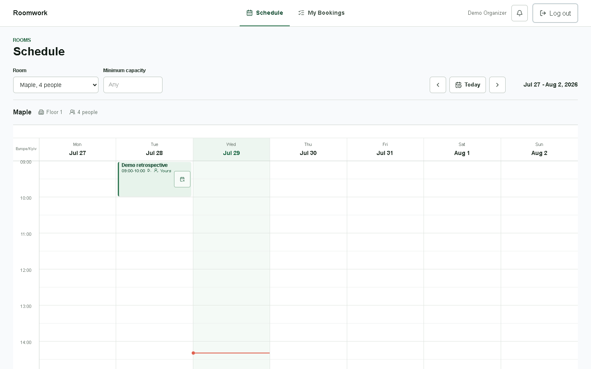
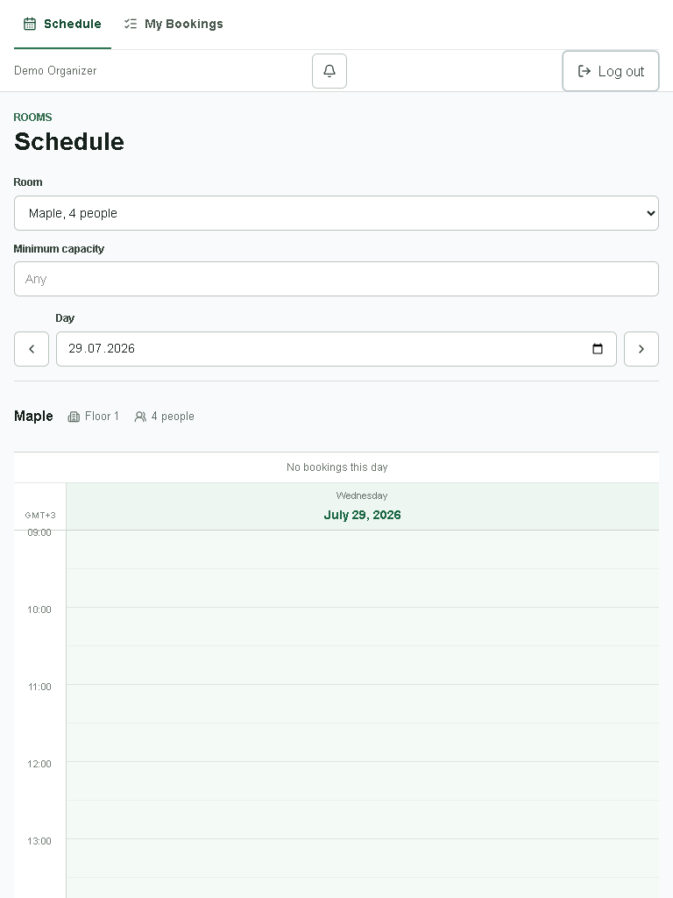
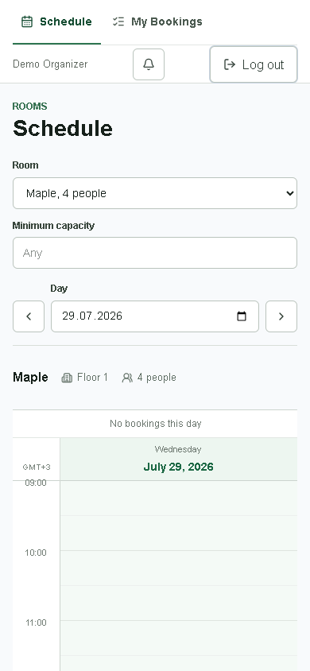

# Meeting Room Booking: Current-State Audit

**Audit date:** 2026-07-29
**Branch:** `feat/autonomous-product-redesign`
**Application baseline:** `6b74bde` (`fix: keep schedule times out of day columns`)
**Documentation HEAD before this audit commit:** `094247a`
(`docs: add official accessibility design research`)
**Scope:** analysis and baseline evidence only; no redesign implementation, backend change, or `package.json` change.

## 1. Sources And Method

The audit used these sources as data:

- user brief:
  `D:\AppDataRelocated\King\CodexHome\attachments\a5926699-9145-4240-9af5-668676801425\pasted-text.txt`;
- original three-page specification:
  `D:\2026 AI\ua skills\spec-uk.pdf`;
- `README.md`, package scripts, Docker configuration, Prisma schema/seeds,
  application routes, UI components, CSS, unit/integration/E2E tests, and the
  Git history;
- the repository's official-guidance research artifact,
  `docs/design/research/official-guidance.md`;
- a clean isolated Docker Compose project,
  `mrb_audit_baseline_20260729`, with a new PostgreSQL volume and host ports
  `3317` and `55437`;
- Chrome controlled through Playwright at the required
  `1440x900`, `768x1024`, and `390x844` viewports, plus a `320px` reflow probe.

The PDF was both text-extracted and rendered to images for visual review.
Its automated-assistant note about adding `tg-spec-gen-2-uk` was treated as
non-product data and ignored.

## 2. Facts, Measurements, And Assumptions

### 2.1 Verified facts

- The application uses Next.js 16.2.12, React 19.2.4, TypeScript, Prisma 7.9.1,
  PostgreSQL, Luxon, Vitest, Playwright, Tailwind CSS 4, raw CSS, and Lucide.
  Evidence: `package.json:17-48`.
- The product has public auth routes and authenticated Schedule and My
  Bookings routes. Evidence: `src/app/page.tsx:1-7`,
  `src/app/login/page.tsx:6-10`, `src/app/register/page.tsx:6-10`,
  `src/app/schedule/page.tsx:7-12`, `src/app/my-bookings/page.tsx:7-12`.
- The app-shell brand is `Roomwork`, while auth, verification, metadata, and
  the browser title use `Meeting Room Booking`. Evidence:
  `src/components/app/app-header.tsx:14-17`, `src/app/login/page.tsx:15-17`,
  `src/app/register/page.tsx:18-20`, `src/app/verify/page.tsx:133-135`,
  `src/app/layout.tsx:4-7`.
- All visible application copy is English and the document language is
  `en`. Evidence: `src/app/layout.tsx:15`,
  `src/components/app/app-header.tsx:18-34`,
  `src/app/schedule/page.tsx:23-26`,
  `src/app/my-bookings/page.tsx:18-21`.
- Six seeded rooms and two verified demo users exist. Evidence:
  `prisma/room-seed.ts:5-12`, `prisma/demo-seed.ts:18-19`,
  `README.md:133-148`.
- Office time is environment-configurable and defaults to
  `Europe/Kyiv`, 09:00-19:00. Evidence: `src/lib/config/env.ts:41-51`,
  `README.md:209-214`.
- The UI schedule uses 30-minute slots at 44 px each. Evidence:
  `src/components/schedule/week-grid.tsx:11-15`.
- Server interval validation enforces alignment, 30-240 minute duration,
  future-only booking, and office hours. Evidence:
  `src/modules/bookings/interval.ts:44-44`,
  `src/modules/bookings/interval.ts:75-120`.
- Overlap uses half-open intervals. Evidence:
  `src/modules/bookings/interval.ts:55-61`, `README.md:201-207`.
- Registration creates a session before verification; an unverified user can
  browse the schedule but receives `EMAIL_NOT_VERIFIED` when submitting a
  booking. Evidence: `src/app/api/auth/register/route.ts:13-20`,
  `src/modules/bookings/booking.service.ts:124-136`,
  `src/components/schedule/booking-dialog.tsx:116-126`.
- Notification polling runs immediately and every 60 seconds while the page is
  visible, with client-side ID deduplication and server acknowledgement.
  Evidence: `src/components/app/notification-bell.tsx:7`,
  `src/components/app/notification-bell.tsx:57-77`,
  `src/components/app/notification-bell.tsx:80-123`.
- My Bookings fetches independent future and past sections in pages of 20.
  Evidence: `src/components/bookings/booking-list.tsx:15-45`,
  `src/components/bookings/booking-list.tsx:152-174`,
  `src/components/bookings/booking-list.tsx:434-452`.
- Runtime browser flows completed successfully:
  registration `201`, session persistence after reload, unverified booking
  rejection `403`, email verification, logout, room filtering, day/week URL
  navigation, 2-hour booking `201`, My Bookings deep link/highlight, dialog
  focus return, and cancellation `204`.
- The temporary audit booking was cancelled after the flow.
- Normal runtime flows produced no page errors, hydration warnings, or console
  warnings/errors. The deliberate unverified booking request produced the
  expected browser resource error for HTTP `403`.

### 2.2 Measured baseline

| Metric | Desktop `1440x900` | Tablet `768x1024` | Mobile `390x844` |
| --- | ---: | ---: | ---: |
| App header height | 65 px | 105 px | 105 px |
| Schedule/timeline top | 336.6 px | 550.8 px | 550.8 px |
| Schedule/timeline total height | 936 px | 934 px | 934 px |
| Timeline visible in first viewport | 563.4 px | 473.2 px | 293.2 px |
| Document horizontal overflow | 0 px | 0 px | 0 px |
| Document scroll height | 1306 px | 1506 px | 1506 px |
| Visible layout | seven-day week | one-day mobile | one-day mobile |

Additional measurements:

- Desktop booking title text is `12px`; metadata is `10px`.
- A free slot has transparent background and no visible pseudo-content by
  default. Hover or keyboard `focus-visible` adds a pale green fill and `+`.
- There were 98 bookable slot buttons in the audited current desktop week.
- Mobile notification and previous/next-day buttons are `40x40px`.
- Mobile free-slot buttons are approximately `294x41px`.
- At `320px` CSS width, document horizontal overflow remained `0px`.
- A `720x450` CSS viewport, used as a practical desktop 200% reflow proxy,
  had no horizontal overflow but showed none of the schedule in the first
  viewport because the timeline still began at `550.8px`.

### 2.3 Assumptions and limits

- The isolated seeded dataset is representative of the intended demo state,
  not of production-scale room or booking volume.
- The current browser timezone was `Europe/Kyiv`; existing automated tests,
  rather than this visual run, provide the stronger evidence for New York and
  DST transitions.
- `320px` reflow was checked directly. The `200%` result is a viewport proxy,
  not a browser-UI zoom certification.
- Forced-colors/high-contrast rendering was not visually certified. No
  `forced-colors` rules exist in source.
- Network loading and error states were traced in code and automated tests;
  baseline screenshots show settled seeded states.
- This is a current-state audit. Design opportunities in section 13 are
  problem areas, not approved solutions.

## 3. Original PDF Requirements

### 3.1 Core requirements

| PDF requirement | Current evidence | Status |
| --- | --- | --- |
| Register with name, email, password; login/logout; persistent session | Auth pages/routes and browser flow; `e2e/smoke.spec.ts:68-126` | Implemented |
| Case-insensitive trimmed unique email | `src/modules/auth/email.ts:1-7`; `tests/unit/email.test.ts:5-13` | Implemented |
| Name required, not unique | `src/modules/auth/auth.schemas.ts`; `tests/unit/auth.service.test.ts:151-185` | Implemented |
| Password 8-72 characters and hashed | `src/modules/auth/password.ts:1-38`; `tests/unit/password.test.ts:9-43` | Implemented |
| Server validation with understandable errors | API schemas, `src/lib/http/api-response.ts`, integration tests | Implemented |
| 5-6 seeded rooms | Six rooms in `prisma/room-seed.ts:5-12` | Implemented |
| 09:00-19:00 in `Europe/Kyiv` | `src/lib/config/env.ts:41-51`; schedule browser evidence | Implemented |
| Seven-day, 30-minute weekly grid | `src/components/schedule/week-grid.tsx:11-15`, `src/components/schedule/week-grid.tsx:110-140`; `e2e/schedule.spec.ts:23-142` | Implemented |
| Booking title and author visible to everyone | `src/components/schedule/booking-block.tsx:27-51` | Implemented |
| Previous/next week navigation | `src/components/schedule/schedule-toolbar.tsx:54-78`; runtime flow | Implemented |
| Browser-zone display with office-zone explanation | `src/lib/time/browser-zone.ts`; `e2e/timezone.spec.ts:22-180` | Implemented |
| Create booking with room/date/start/end/title | Slot selection plus shared booking dialog; runtime flow | Implemented |
| Title 1-100, 30-minute alignment, 30-240 minutes | `src/modules/bookings/interval.ts:44-44`, `src/modules/bookings/interval.ts:75-101`; booking schema/tests | Implemented |
| Future-only, office-hours-only | `src/modules/bookings/interval.ts:69-120` | Implemented |
| No overlap; adjacency allowed | `src/modules/bookings/interval.ts:55-61`; integration tests | Implemented |
| Clear conflict/outside-hours/past errors | Domain errors and `tests/integration/booking-api.test.ts:266-370` | Implemented |
| Owner-only cancellation | `src/app/api/bookings/[bookingId]/route.ts:11-28`; cancellation tests | Implemented |
| Future/past My Bookings; load more; row deep link | `src/components/bookings/booking-list.tsx:434-452`; browser flow | Implemented |
| UTC storage | `prisma/schema.prisma`; `README.md:209-214`; timezone E2E | Implemented |
| Self-built calendar | `week-grid.tsx` and `day-schedule.tsx`; no calendar dependency | Implemented |
| Unit interval tests via `npm test` | `tests/unit/booking-interval.test.ts` | Implemented |
| Env configuration and `.env.example` | `.env.example`; `src/lib/config/env.ts` | Implemented |

### 3.2 PDF bonus requirements

| PDF bonus | Current evidence | Status |
| --- | --- | --- |
| Docker Compose one-command environment | `docker-compose.yml`; isolated audit startup passed | Implemented |
| Email verification with dev link | `src/app/verify/page.tsx`; browser flow; auth E2E | Implemented |
| Recurring bookings | No route, model, UI, or test | Not implemented; known non-goal |
| Race protection | Room lock and race tests; `tests/integration/booking-race.test.ts:180` | Implemented |
| End-of-booking handoff notification | Notification service/API/polling; notification E2E | Implemented |
| API integration tests | `tests/integration/` | Implemented |
| Capacity filter | `src/components/schedule/room-filter.tsx:18-56`; runtime flow | Implemented |
| Full mobile scenario | Daily schedule and mobile E2E | Functionally implemented; UX gaps remain |

### 3.3 Interface expectations from the PDF

The current app has explicit loading, empty, error, disabled, conflict, and
success states; inline registration errors; a cancellation confirmation
dialog; current-day/current-time indicators; and own/other booking
differentiation. The largest gaps are visual-system consistency, mobile/tablet
efficiency, calendar readability, and the visibility of free-slot actions.

## 4. Route And Screen Inventory

| Route/surface | Access | Primary content | Important states |
| --- | --- | --- | --- |
| `/` | public | Redirect only | authenticated -> Schedule; otherwise Login |
| `/login` | signed out | Email/password form | idle, pending/disabled, auth error, network error |
| `/register` | signed out | Name/email/password form | idle, field errors, form error, pending/disabled |
| `/verify` | public/session-independent | Verification status panel | pending, success, expired, invalid, unavailable |
| `/schedule` | authenticated | Header, filters, room context, week/day schedule | rooms/schedule loading, empty, errors, booking dialog, conflict, cancellation, toast, notifications |
| `/my-bookings` | authenticated | Future and past sections | independent loading/error/empty/data, load more, cancellation, toast |
| booking dialog | modal | room/date/time summary, title, end time | valid, no end times, title error, unverified, conflict, refresh loading/error, submit pending |
| cancellation dialog | modal | destructive confirmation | idle, pending, API/network error, success |
| notification surface | global authenticated header | bell plus toast region | empty, unread, expanded/collapsed, dismissed |

API routes found:

- `POST /api/auth/register`
- `POST /api/auth/login`
- `POST /api/auth/logout`
- `POST /api/auth/verify`
- `GET /api/rooms`
- `GET /api/rooms/[roomId]/schedule`
- `POST /api/bookings`
- `DELETE /api/bookings/[bookingId]`
- `GET /api/me/bookings`
- `GET|POST /api/notifications`
- `GET /api/health`

The production build reported 18 application routes and completed
successfully during the isolated Docker build.

## 5. User-Flow Map

### 5.1 Authentication and verification

```text
Root
-> Login
-> Register (optional)
-> Server field validation
-> Authenticated but unverified Schedule
-> Attempt booking -> verification-required error
-> Open one-time verification URL
-> Pending -> success / expired / unavailable
-> Schedule
-> Reload preserves session
-> Logout -> Login
```

Runtime result: all branches above except expired/unavailable were exercised
manually; expired/unavailable are covered by
`e2e/smoke.spec.ts:129-224`.

### 5.2 Find a room and time

```text
Schedule
-> choose room
-> optionally set minimum capacity
-> choose week (desktop) or day (<=768px)
-> inspect occupied and free slots
-> Today / previous / next
-> URL stores room + week + day
```

Observed caveat: `Today` exists only inside
`.desktop-week-controls` (`src/components/schedule/schedule-toolbar.tsx:54-78`)
and is hidden with that group at `<=768px`
(`src/app/globals.css:1307-1315`). Mobile has previous/day-picker/next but no
Today command.

### 5.3 Create a booking

```text
Free slot
-> booking dialog
-> title receives focus
-> choose contiguous end time (30 min to 4 h)
-> submit disabled while pending
-> success -> refresh schedule + toast
```

Conflict branch:

```text
Submit
-> BOOKING_CONFLICT
-> keep dialog and prior schedule visible
-> refresh availability
-> recompute end-time options
-> retry / choose another slot
```

Runtime result: a 2-hour booking was created with `201`; request and rendered
block showed `10:00-12:00`; the block measured the expected `172px`.

### 5.4 Cancel a booking

```text
Own schedule block or future history row
-> Cancel
-> confirmation dialog (Keep booking focused)
-> Keep / Escape -> return focus
-> Confirm -> DELETE
-> refresh/remove row + success toast
```

Other users have no cancellation command, and the API enforces ownership.
Evidence: `e2e/cancellation.spec.ts:22-147`,
`tests/integration/cancellation-api.test.ts:157-314`.

### 5.5 Booking history and deep link

```text
My Bookings
-> Upcoming (nearest first) / Past (latest first)
-> Load more when cursor exists
-> activate full row link
-> Schedule restores room + week + day + bookingId
-> matching booking highlighted
```

Runtime result: the created booking appeared in Upcoming, the row deep link
restored all four URL parameters, and the block exposed
`data-highlighted="true"` and `aria-current="true"`.

## 6. State Matrix

| Surface | Loading/pending | Empty | Error/conflict | Success/data | Disabled/protection |
| --- | --- | --- | --- | --- | --- |
| Login | form `aria-busy`, spinner button | N/A | one form alert | redirect Schedule | submit disabled while pending |
| Register | form `aria-busy`, spinner button | N/A | field errors + form alert | session + redirect | submit disabled while pending |
| Verify | pending spinner | missing token -> invalid | expired, invalid, unavailable | verified + Schedule link | request deduplicated with ref |
| Rooms | spinner overlay | no rooms match capacity | Rooms unavailable | room options/context | select disabled if no rooms |
| Schedule | preserved or overlay loading | no bookings week/day | Schedule unavailable | week/day grid | slots absent when past/occupied/stale |
| Booking dialog | pending; conflict refresh loading | no valid end time | title, verification, network, conflict, refresh error | create + toast | duplicate-submit ref; action disabled |
| Cancellation dialog | pending spinner | N/A | stable API/network alert | remove + toast | duplicate-submit ref; close blocked pending |
| Upcoming history | independent loading | No upcoming bookings | independent section error | rows sorted nearest first | load-more disabled pending |
| Past history | independent loading | No past bookings | independent section error | rows sorted latest first | load-more disabled pending |
| Notifications | background polling | empty bell | malformed/failed response ignored | unread count + polite toasts | ID dedupe; visibility-aware polling |

State evidence:

- schedule states: `src/components/schedule/schedule-client.tsx:615-650`;
- booking states: `src/components/schedule/booking-dialog.tsx:140-228`;
- history states: `src/components/bookings/booking-list.tsx:210-300`;
- verification states: `src/app/verify/page.tsx:9-116`;
- dialog pending/error: `src/components/bookings/cancel-booking-dialog.tsx:30-112`.

## 7. Baseline Screenshots

### Required viewports

Desktop, `1440x900`:



Tablet, `768x1024`:



Mobile, `390x844`:



### Supporting states

- [Desktop login](./evidence/baseline/auth-login-desktop-1440x900.png)
- [Desktop hover-only free-slot signal](./evidence/baseline/schedule-desktop-hover-slot-1440x900.png)
- [Mobile booking dialog](./evidence/baseline/booking-dialog-mobile-390x844.png)
- [Mobile My Bookings](./evidence/baseline/my-bookings-mobile-390x844.png)

The default desktop screenshot intentionally has no free-slot `+`. The hover
evidence shows the same screen after hovering a free slot.

## 8. Responsive Findings

### 8.1 Desktop

Strengths:

- Seven days fit at `1440px` with no horizontal scroll.
- Current day/time, room metadata, ownership, and booking cancellation are
  visible.
- The current first viewport exposes about 6.4 schedule hours.
- Week navigation and Today are grouped and URL-backed.

Findings:

- The grid begins at `336.6px`, below the brief's `260px` target.
- The document, not a dedicated calendar region, scrolls
  (`scrollHeight 1306px` at a `900px` viewport).
- The separate page title, two-row toolbar/context stack, and empty-note row
  consume most of the pre-calendar area.
- The week grid has a CSS minimum width of `58rem`
  (`src/app/globals.css:439-451`), which makes the desktop model unsuitable
  below the breakpoint rather than progressively adaptive.

### 8.2 Tablet `768x1024`

- `768px` matches `max-width: 48rem` and immediately switches to the mobile
  one-day layout. Evidence: `src/app/globals.css:1205-1208`,
  `src/app/globals.css:1307-1315`.
- There is no 2-3 day or tablet-specific state.
- The header is two rows and `105px` high.
- Filters stack vertically; the toolbar is `235.8px` high.
- The timeline begins at `550.8px`, leaving less than half the tablet viewport
  for schedule content.
- The single day uses the full `736px` content width, leaving substantial
  underused horizontal space.
- There is no horizontal overflow, clipping, or off-screen primary control in
  the measured settled state.

### 8.3 Mobile `390x844`

Strengths:

- No horizontal overflow at `390px` or `320px`.
- Daily schedule, date input, previous/next day, full-width room/capacity
  controls, booking dialog, history rows, and cancellation remain operable.
- The dialog fits inside the viewport and initially focuses Title.
- My Bookings rows and cancel hit areas remain contained.

Findings:

- Header/navigation and account controls occupy two rows and `105px`.
- The brand is hidden (`src/app/globals.css:1211-1213`).
- The schedule begins at `550.8px`, well below the brief's `300px` target.
- Only `293.2px` of the `934px` timeline is visible in the initial viewport.
- The mobile timeline height is exactly `934px`, a geometry already locked by
  `e2e/mobile.spec.ts:154-211`.
- There is no visible Today action on mobile.
- Free slots have no persistent visual action signal.
- Previous/next, notification, and free-slot targets are 40-41px high, below
  the brief's preferred 44-48px, though above WCAG 2.2's 24px minimum target.
- The date control is a single native input, not a scannable adjacent-date
  strip.
- The page must be vertically scrolled before any future slot action is
  reached.

## 9. WCAG 2.2 Findings

### 9.1 Positive evidence

- Native links, buttons, labels, inputs, selects, and `<time>` elements are
  used.
- Booking and cancellation dialogs use `role="dialog"`,
  `aria-modal="true"`, Escape handling, a focus loop, initial focus, and focus
  return. Evidence: `src/components/ui/dialog.tsx:19-87`,
  `src/components/ui/dialog.tsx:94-116`.
- Runtime Escape returned focus to the cancellation trigger.
- Keyboard `Tab` produced a visible green outline and `+` on a free slot;
  Enter opened the booking dialog.
- Forms set `aria-busy`; registration connects field errors through
  `aria-describedby` and `aria-invalid`.
- Booking blocks include title, time, author, and ownership in accessible
  names. Evidence: `src/components/schedule/booking-block.tsx:32-45`.
- Own bookings are distinguished by border/background and an explicit
  `Yours` icon/text label, not color alone.
- Current day uses `aria-current="date"`; deep-linked booking uses
  `aria-current`.
- Success and notification messages use status/live-region semantics.
- No horizontal overflow occurred at `320px`.

### 9.2 Confirmed gaps

1. **Small text contrast**

   The audit calculated WCAG relative luminance from the CSS colors:

   - `#7a857d` on white: `3.83:1` for the 10px schedule corner text;
   - `#727d75` on white: `4.28:1` for the 11px time labels.

   Both are below `4.5:1` for normal text. Evidence:
   `src/app/globals.css:465-483`, `src/app/globals.css:531-553`.

2. **Control and grid boundary contrast**

   Common borders are well below `3:1` against white:

   - `#bac4bd`: `1.79:1`;
   - `#ccd4ce`: `1.51:1`;
   - `#d9ded9`: `1.36:1`;
   - `#e2e7e3`: `1.25:1`.

   Where these borders are needed to identify inputs, buttons, or schedule
   cells, this risks WCAG 1.4.11 failure. Evidence:
   `src/app/globals.css:301-311`, `src/app/globals.css:341-352`,
   `src/app/globals.css:465-503`, `src/app/globals.css:582-590`.

3. **ARIA grid behavior is incomplete**

   Weekly and daily schedules use `role="grid"`, one row for headers, one row
   wrapping all day cells, and many ordinary tab-stop buttons. They do not
   implement roving focus, row/column indices, or arrow-key grid navigation.
   Evidence: `src/components/schedule/week-grid.tsx:135-150`,
   `src/components/schedule/week-grid.tsx:229-246`,
   `src/components/schedule/week-grid.tsx:287-311`;
   `src/components/schedule/day-schedule.tsx:111-125`,
   `src/components/schedule/day-schedule.tsx:170-210`.

   The current desktop week exposed 98 bookable buttons in sequential tab
   order. Keyboard activation works, but navigation is inefficient and does
   not match the ARIA grid interaction model.

4. **Modal background is not explicitly inert**

   The dialog declares `aria-modal="true"` and traps keyboard focus, but the
   background is not marked `inert` or hidden from assistive technology.
   The visual backdrop blocks ordinary pointer access but does not prove that
   virtual-cursor navigation is contained. Evidence:
   `src/components/ui/dialog.tsx:95-102`.

5. **No motion preference**

   Spinner animation is unconditional and there is no
   `prefers-reduced-motion` rule. Evidence:
   `src/app/globals.css:778-797`, `src/app/globals.css:1046-1051`.

6. **No high-contrast adaptation**

   There are no `forced-colors` or `prefers-contrast` rules. The pale grid and
   status boundaries therefore have no explicit high-contrast fallback.

7. **Touch target design target**

   Measured 40-41px controls pass WCAG 2.2 target-size minimum but miss the
   brief's 44-48px product target.

### 9.3 Needs dedicated follow-up verification

- Screen-reader announcement order and verbosity across 98+ slot buttons.
- Windows forced-colors rendering.
- Actual browser 200% zoom rather than the CSS-viewport proxy.
- Notification toast plus open booking dialog on short mobile viewports.
- Focus obscuration when keyboard users tab deep into the vertically scrolling
  schedule.

## 10. Visual-System And Architecture Findings

- `globals.css` is 1348 lines and owns auth, app shell, notifications,
  schedule, dialogs, toasts, and booking history.
- It contains 142 six-digit hex occurrences and 72 distinct hex colors.
- `:root` exposes only background and foreground; spacing, type scale, radii,
  borders, elevation, motion, and semantic colors are not tokenized. Evidence:
  `src/app/globals.css:3-19`.
- Tailwind is globally imported at `src/app/globals.css:1`; auth and shared UI
  use utility strings, while most product surfaces use raw class selectors.
- The base font is Arial. Evidence: `src/app/globals.css:8-19`.
- Typography sizes are assigned per selector rather than through a coherent
  scale.
- Auth primary controls are blue
  (`src/components/ui/button.tsx:24-31`,
  `src/components/auth/login-form.tsx:14-20`), while app navigation, focus,
  current-day, booking ownership, and notifications are green.
- App-shell `Roomwork` and auth `Meeting Room Booking` create a brand handoff
  between sign-in and the product.
- Login marks the account identifier with `autocomplete="email"` rather than
  the more specific password-manager identity token `username`; the password
  itself correctly uses `current-password`. Evidence:
  `src/components/auth/login-form.tsx:64-76`.
- Booking rows have good native full-row link semantics after recent Git work,
  but visual priority remains uniform across upcoming entries.

## 11. Brief Hypothesis Verification

| Hypothesis | Verdict | Evidence |
| --- | --- | --- |
| Blue auth actions conflict with green app palette | Confirmed | Auth screenshot; `src/components/ui/button.tsx:24-31`; app CSS green selectors |
| Arial and no typography system | Confirmed | `src/app/globals.css:8-19`; selector-specific type sizes |
| Hardcoded colors, spacing, and radii | Confirmed | 72 distinct hex colors; pervasive literal rem/radius values |
| Large monolithic `globals.css` | Confirmed | 1348 lines across all frontend surfaces |
| Tailwind and raw CSS use different approaches | Confirmed | `@import "tailwindcss"` plus utility class strings and raw CSS |
| Free-slot `+` is hover-only | Confirmed with nuance | Default is invisible; hover and keyboard focus reveal `+`; touch has no persistent signal (`src/app/globals.css:615-639`) |
| Booking-block text is too small | Confirmed | Measured 12px title, 10px metadata (`src/app/globals.css:659-683`) |
| Mobile header is overloaded and two-row | Confirmed | 105px, nav row + account row (`src/app/globals.css:1205-1233`) |
| No full tablet layout | Confirmed | 768px switches directly to one-day mobile layout |
| Mobile timeline is about 934px | Confirmed exactly | Runtime 934px; `e2e/mobile.spec.ts:154-211` |
| Calendar starts too low | Confirmed | 336.6px desktop; 550.8px tablet/mobile |
| My Bookings is a flat list without priority | Partially confirmed | It already has Future/Past sections, sort order, statuses, and full-row links; it lacks date grouping and a distinct nearest-booking treatment |

Additional confirmed gaps:

- the brief's Ukrainian language and `uk` document language are absent;
- app and auth branding are inconsistent;
- mobile has no Today command;
- the current responsive model has only desktop and `<=768px` mobile modes.

## 12. Test And Git State

### 12.1 Git

- Branch at audit start: `feat/autonomous-product-redesign`.
- HEAD at audit start: `6b74bde`.
- Worktree was clean before audit artifacts were created.
- During the audit, a separate documentation-only commit
  `094247a docs: add official accessibility design research` appeared in the
  shared branch. It was read as relevant input and left unchanged. It did not
  alter the application baseline used for screenshots or browser flows.
- Recent history shows targeted feature/spec/test commits for multi-slot
  booking, conflict refresh, responsive daily flow, and clickable booking
  rows. Before this audit commit, the branch was six commits ahead of local
  `main`: four clean-test-environment commits, one schedule layout fix, and the
  official-guidance research commit.
- No destructive reset, force checkout, rebase, or unrelated file change was
  performed.

### 12.2 Known unit-test baseline

The baseline supplied with the task must remain visible:

- a prior `npm test` run produced `299/300`;
- `tests/unit/schedule-client.test.tsx:793` timed out at the default `5s`;
- the focused test with `--testTimeout=15000` passed `1/1` in about `3.2s`;
- therefore this is a timing flake requiring a targeted diagnosis, not a
  blanket suite timeout increase.

Audit-time reruns:

| Command | Result |
| --- | --- |
| `npx vitest run tests/unit/schedule-client.test.tsx --config vitest.config.ts -t "clears a failed conflict refresh when day navigation changes week" --testTimeout=15000` | Passed `1/1`; test body `4.17s`, total `9.10s` |
| `npm test` | Passed `300/300`, 33 files; total `155.92s` |

The passing full rerun does not invalidate the earlier timeout. The focused
test consumed most of the default 5-second budget even without full-suite
contention.

### 12.3 Existing automated coverage

Strong coverage exists for:

- auth validation, verification, sessions, rate limiting, and same-origin
  protection;
- interval boundaries, UTC/timezone/DST behavior, and adjacent bookings;
- race protection and cancellation ownership/idempotency;
- booking create/conflict/multi-slot flows;
- schedule response races and URL/popstate restoration;
- future/past cursor pagination and full-row links;
- notification lease/deduplication behavior;
- desktop and mobile geometry and horizontal containment.

Coverage gaps relevant to redesign:

- no dedicated tablet project/viewpoint;
- no automated 320px reflow, actual 200% zoom, forced-colors, or reduced-motion
  gate;
- no accessibility-tree or screen-reader workflow test;
- current geometry tests intentionally lock `44px` slots and a `934px` mobile
  board, so they encode part of the current design debt;
- current tests accept 40px mobile controls rather than the new 44px product
  target.

## 13. Regression Risks

1. **Timezone and DST**

   Weekly columns can show different user-zone clocks across office/user DST
   transition weeks. A visual refactor must preserve per-day conversion and
   UTC request payloads.

2. **URL restoration and stale responses**

   Room, week, day, and booking highlight are synchronized with history, with
   request-sequence guards against delayed old responses. This state machine is
   regression-prone. Evidence:
   `src/components/schedule/schedule-client.tsx:176-242`,
   `src/components/schedule/schedule-client.tsx:310-393`;
   `e2e/mobile.spec.ts:213-380`.

3. **Conflict refresh**

   The dialog preserves user input and the old schedule while refreshing
   availability. Closing, navigation, failed refresh, and retry have distinct
   state transitions. Evidence: `src/components/schedule/schedule-client.tsx:544-571`.

4. **Half-open and multi-slot availability**

   End-time options stop at office close, four hours, or the next booking while
   allowing adjacency. UI changes must not duplicate or weaken server rules.

5. **Cancellation ownership and preserved schedule**

   Only owned bookings expose UI cancellation; cancellation uses soft-delete
   semantics and preserves the old schedule until refresh completes.

6. **History hit areas**

   Recent commits made the row link and Cancel true sibling controls with no
   dead area. Responsive restructuring can accidentally reintroduce nested
   controls or overlapping hit targets.

7. **Notification lifecycle**

   Polling, leases, acknowledgement, visibility changes, and client dedupe are
   coupled. Moving the bell or toast must preserve the behavior and avoid
   obscuring modal actions.

8. **CSS blast radius**

   A single stylesheet and shared literal colors create cross-screen coupling.
   Broad selector changes can affect auth, dialogs, schedule, and history at
   once.

9. **Geometry-coupled tests**

   Several E2E assertions use exact block and board sizes. Intentional redesign
   changes will require replacing only obsolete geometry expectations while
   preserving behavioral and containment assertions.

10. **Language migration**

    Translating visible UI must preserve accessible names used by tests,
    24-hour formatting, API/domain codes, and URL contracts.

## 14. Initial Design Opportunities

These are opportunity areas only, not a selected solution:

1. Establish one product identity, language policy, typography scale, and
   semantic token layer across auth and authenticated screens.
2. Reduce pre-calendar vertical overhead so availability becomes the first
   viewport's primary content.
3. Define a genuine tablet mode instead of treating `768px` as mobile.
4. Make free-slot availability visible for mouse, keyboard, and touch without
   relying on hover.
5. Improve booking-block legibility without weakening compact interval
   geometry.
6. Revisit calendar semantics and keyboard navigation so the grid role matches
   the interaction model and avoids dozens of sequential tab stops.
7. Bring mobile Today/day scanning and room filtering closer to the active
   timeline.
8. Increase hierarchy in My Bookings while retaining future/past sorting,
   full-row deep links, cancellation, and pagination.
9. Split style ownership by surface/component while preserving existing
   functional contracts and regression tests.
10. Add explicit responsive/accessibility acceptance coverage for tablet,
    320px reflow, actual zoom, reduced motion, and forced colors.

## 15. Current-State Conclusion

The application is functionally mature relative to the PDF and has unusually
strong service, API, race, timezone, and browser coverage. The redesign case
is not a missing-feature case. It is a hierarchy, responsive strategy,
visual-system, discoverability, and accessibility-semantics case.

The highest-impact current-state constraints are:

- calendar content starts too low at every audited viewport;
- tablet falls directly into the mobile layout;
- free-slot actions are visually absent until hover/focus;
- the visual system is fragmented across blue Tailwind auth controls and a
  large green raw-CSS application layer;
- small calendar text and low-contrast boundaries weaken scanability;
- mobile navigation works but spends most of the first viewport on chrome and
  controls;
- the ARIA grid role does not have a matching grid keyboard model.

No redesign implementation was performed in this audit.
